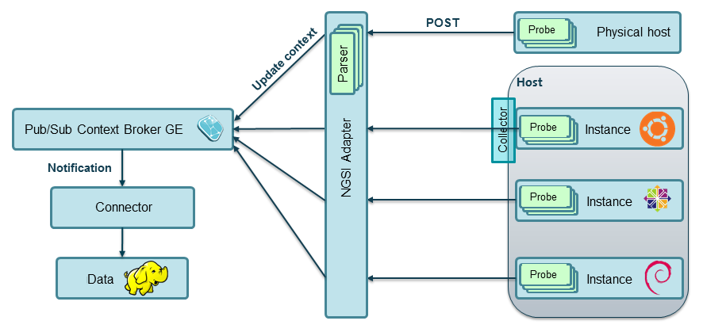

Installation and Administration Guide
_____________________________________

Introduction
============

This guide defines the procedure to install the different components that build
up the Monitoring GE, including its requirements and possible troubleshooting.

Installation
============

Monitoring infrastructure comprises several elements distributed across
different hosts, as depicted in the following figure:

   ..

   #. **Probes**, installed at every host being monitored.
   #. **NGSI Adapter**, responsible for translating probe raw data into a
      common format (NGSI).
   #. **Parsers** at NGSI Adapter, specific for the different probes that
      generate monitoring data.
   #. **Context Broker GE**, where monitoring data (expressed as "NGSI
      context updates") will be published.
   #. **BigData GE**, for analysis of historical context data.
   #. **BigData Connector** between Context Broker and BigData GEs.

Installation of probes
----------------------

Monitoring GE is agnostic to the framework used to gather monitoring data. It
just assumes there are several probes collecting such data, which somehow will
be forwarded to the adaptation layer (NGSI Adapter).

It is up to the infrastructure owner which tool (like `Nagios`_, `Zabbix`_,
`openNMS`_, `perfSONAR`_, etc.) is installed for this purpose.

Probes must "publish" their data to NGSI Adapter. Depending on the exact
monitoring tool installed, a kind of *collector* has to be deployed in
order to send data to the adapter:

-  **NGSI Event Broker** is an example specific for Nagios, implemented as
   a loadable module. Description and installation details can be found
   `here <../ngsi_event_broker/README.rst>`__.

Installation of NGSI Adapter
----------------------------

Requirements
~~~~~~~~~~~~

NGSI Adapter should work on a variety of operating systems, particularly on the
majority of GNU/Linux distributions (e.g. Debian, Ubuntu, CentOS), as it only
requires a V8 JavaScript Engine to run a Node.js server.

Hardware Requirements
^^^^^^^^^^^^^^^^^^^^^

The minimal requirements are:

-  RAM: 2 GB

Software Requirements
^^^^^^^^^^^^^^^^^^^^^

NGSI Adapter is a standalone Node.js process, so ``node`` and its package
manager ``npm`` should be installed previously. These requirements are
automatically checked when installing the ``ngsi_adapter`` package. However,
for manual installation please check
\ https://github.com/joyent/node/wiki/Installing-Node.js-via-package-manager\ :

-  Installation in Ubuntu

.. code::

   $ curl -sL https://deb.nodesource.com/setup | sudo bash -
   $ sudo apt-get install nodejs

-  Installation in Debian (as root)

.. code::

   # apt-get install curl
   # curl -sL https://deb.nodesource.com/setup | bash -
   # apt-get install nodejs nodejs-legacy

-  Installation in CentOS (requires EPEL: Extra Packages for Enterprise Linux)

.. code::

   $ sudo yum install http://dl.fedoraproject.org/pub/epel/6/x86_64/epel-release-6-8.noarch.rpm
   $ sudo yum install nodejs npm --enablerepo=epel

Downloads
~~~~~~~~~

Package for Ubuntu 12.04 LTS is available for download at part of
`FIWARE 3.5.2 release`_.

.. code::

   $ sudo apt-get install fiware-monitoring-ngsi-adapter

For the latest version, please download zip from
\ https://github.com/telefonicaid/fiware-monitoring/archive/master.zip\ .
This includes the *ngsi_adapter* directory corresponding to the NGSI Adapter
component.

.. code::

   $ unzip master.zip

Dependencies
~~~~~~~~~~~~

NGSI Adapter requires some packages, which can be installed using the ``npm``
package manager. In case of manual installation from sources, please run:

.. code::

   $ cd ngsi_adapter/src
   $ npm install

Installation of parsers
-----------------------

NGSI Adapter currently includes a predefined set of parsers for Nagios probes
at ``src/lib/parsers/`` directory, each parser named after its corresponding
probe. New custom parsers should be placed here.

Installation of Context Broker GE
---------------------------------

Please refer to `Orion Context Broker - Installation and Administration Guide`__
for installation details.

__ `Orion - Admin guide`_

Installation of BigData GE
--------------------------

Please refer to `BigData Analysis - Installation and Administration Guide`__
for installation details.

__ `Cosmos - Admin guide`_

Installation of the connector
-----------------------------

This component subscribes to changes at Context Broker and writes them into
BigData GE storage. Historically the **ngsi2cosmos** connector implementation
has been used (installation details `here`__), although from March 2014 this
component is deprecated and a brand new **Cygnus** implementation (installation
details `here`__) is available.

__ `ngsi2cosmos`_
__ `Cygnus`_

Running the monitoring components
=================================

As stated before, there are a number of distributed components involved in the
monitoring. Please refer to their respective installation manuals for execution
details (this applies to probes & monitoring software, Context Broker, BigData,
etc.). This section focuses on NGSI Adapter specific instructions.

Running NGSI Adapter
--------------------

Once installed, there are two ways of running NGSI Adapter: manually from the
command line or as a system service. It is not recommended to mix both ways
(e.g. start it manually but using the service scripts to stop it).

From the command line
~~~~~~~~~~~~~~~~~~~~~

You can run the adapter just typing the following command from
``ngsi_adapter/src/`` directory:

.. code::

   $ adapter

You can use command line arguments, e.g. to specify the port in adapter listens:

.. code::

   $ adapter --listenPort 5000

Help for command line options:

.. code::

   $ adapter --help

As system service
~~~~~~~~~~~~~~~~~

When installed from its package distribution, a Linux service ``ngsi_adapter``
is configured (but not started). The following variables should be checked at
``/etc/init.d/ngsi_adapter`` script prior starting the service:

DAEMON
   Full path of ``adapter`` script
DAEMON\_ARGS
   Command line arguments
DAEMON\_USER
   Linux user to run service

Once the service has been configured, the following commands are available to
control its execution:

.. code::

   $ sudo service ngsi_adapter start
   $ sudo service ngsi_adapter stop
   $ service ngsi_adapter status

Configuration options
~~~~~~~~~~~~~~~~~~~~~

These options can be used directly (in the case of running from the command
line, but prepending ``--`` prefix) or as part of the default configuration
(see ``defaults`` at the configuration file
``ngsi_adapter/src/config/options.js``):

listenHost
   The hostname or address at which NGSI Adapter listens
listenPort
   The port number at which NGSI Adapter listens
brokerUrl
   The URL of the Context Broker instance to publish data to
retries
   Number of times a request to Context Broker is retried, in case of error

Besides, logging options are controlled by ``opts`` at the configuration file
``ngsi_adapter/src/config/logger.js``:

logLevel
   Verbosity of log messages
logFile
   Full path of log file
logMaxSize
   Maximum size (in bytes) of log file
logMaxFiles
   Maximum number of rotating log files

Sanity check procedures
=======================

These are the steps that a System Administrator will take to verify that an
installation is ready to be tested. This is therefore a preliminary set of
tests to ensure that obvious or basic malfunctioning is fixed before proceeding
to unit tests, integration tests and user validation.

End to End testing
------------------

-  At the monitored host, reschedule some probe execution to force the
   generation of new monitoring data.

-  Check NGSI Adapter logs for incoming requests with raw data and
   outgoing Context Broker requests as NGSI updateContext() operations:

.. code::

   $ cat ngsi_adapter.log
   ... << HTTP POST
   ... >> 200 OK
   ... << Body ...raw monitoring data...
   ... POST http://contextbroker:1026/

-  Finally, query Context Broker for new data (see details `here`__)

__ `Orion - queryContext`_

List of Running Processes
-------------------------

A ``node`` process running the "adapter" server should be up and running, e.g.:

.. code::

   $ ps -C node -f | grep adapter
   fiware   21930     1  0 Mar28 ?        00:06:06 node /usr/local/monitoring/ngsi_adapter/src/adapter

Alternatively, we can check if service is running, e.g.:

.. code::

   $ service ngsi_adapter status
     * ngsi_adapter is running

Network interfaces Up & Open
----------------------------

NGSI Adapter uses TCP 1337 as default port, although it can be changed using
the ``--listenPort`` command line option.

Databases
---------

This component does not persist any data, and no database engine is needed.

Diagnosis Procedures
====================

The Diagnosis Procedures are the first steps that a System Administrator will
take to locate the source of an error in a GE. Once the nature of the error is
identified with these tests, the system admin will very often have to resort to
more concrete and specific testing to pinpoint the exact point of error and a
possible solution. Such specific testing is out of the scope of this section.

Resource availability
---------------------

Although we haven't done yet a precise profiling on NGSI Adapter, tests done in
our development and testing environment show that a host with 2 CPU cores and
4 GB RAM is fine to run server.

Remote Service Access
---------------------

-  Probes at monitored hosts should have access to NGSI Adapter listen
   port (TCP 1337, by default)

-  NGSI Adapter should have access to Context Broker listen port (TCP 1026,
   by default)

-  Connector should have access to Context Broker listen port in order
   to subscribe to context changes

-  Context Broker should have access to Connector callback port to notify
   changes

Resource consumption
--------------------

Please refer to `Context Broker`__ and `BigData`__ resource consumption
sections.

__ `Resource consumption - Orion`_
__ `Resource consumption - Cosmos`_

I/O flows
---------

Figure at `installation section <#Installation>`__ shows the I/O flows among
the different monitoring components:

-  Probes send requests to NGSI Adapter with raw monitoring data

-  NGSI Adapter sends request to Context Broker in terms of context
   updates of the monitored resources

-  Context Broker notifies Connector with every context change

-  Connector writes changes to BigData storage

.. REFERENCES

.. _FIWARE 3.5.2 release: https://forge.fi-ware.org/frs/?group_id=7&release_id=529#cloud-monitoring-3-5-2-title-content
.. _Resource consumption - Orion: https://forge.fi-ware.org/plugins/mediawiki/wiki/fiware/index.php/Publish/Subscribe_Broker_-_Orion_Context_Broker_-_Installation_and_Administration_Guide#Resource_consumption
.. _Resource consumption - Cosmos: https://forge.fi-ware.org/plugins/mediawiki/wiki/fiware/index.php/BigData_Analysis_-_Installation_and_Administration_Guide#Resource_consumption
.. _Orion - queryContext: https://forge.fi-ware.org/plugins/mediawiki/wiki/fiware/index.php/Publish/Subscribe_Broker_-_Orion_Context_Broker_-_User_and_Programmers_Guide#Query_Context_operation
.. _Orion - Admin guide: https://forge.fi-ware.org/plugins/mediawiki/wiki/fiware/index.php/Publish/Subscribe_Broker_-_Orion_Context_Broker_-_Installation_and_Administration_Guide
.. _Cosmos - Admin guide: https://forge.fi-ware.org/plugins/mediawiki/wiki/fiware/index.php/BigData_Analysis_-_Installation_and_Administration_Guide
.. _ngsi2cosmos: https://github.com/telefonicaid/fiware-livedemoapp#ngsi2cosmos
.. _Cygnus: https://github.com/telefonicaid/fiware-connectors/tree/develop/flume
.. _Nagios: http://www.nagios.org/
.. _Zabbix: http://www.zabbix.com/
.. _openNMS: http://www.opennms.org/
.. _perfSONAR: http://www.perfsonar.net/
