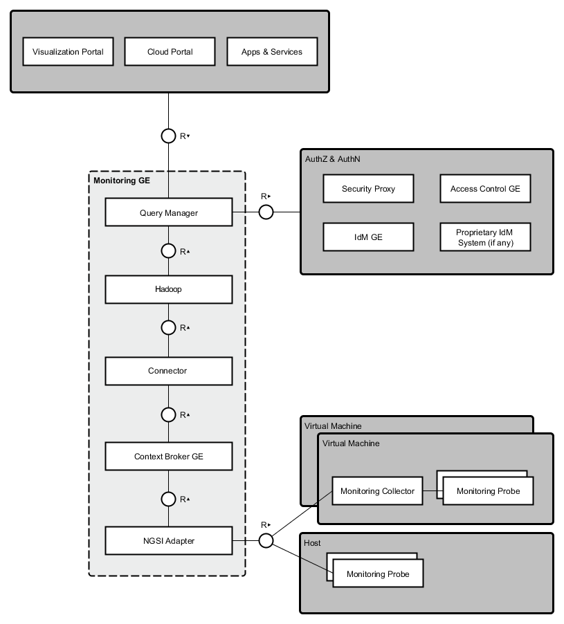
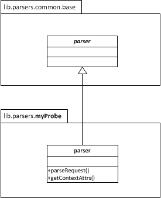

============================
 User and Programmers Guide
============================

Introduction
============

Welcome the User and Programmers Guide for the Monitoring Generic Enabler.
This GE is built up from different distributed components, as depicted in the
following figure:

   ..

Background and Detail
---------------------

This User and Programmers Guide relates to the Scalability Manager GE which is
part of the `Cloud Hosting Chapter`__. Please find more information about this
Generic Enabler in the following `Open Specification`__.

__ `FIWARE Cloud Hosting Chapter`_
__ `FIWARE Monitoring - Open Specification`_

User Guide
==========

This GE does not provide an interactive user interface, hence there is no
User Guide. The following section elaborates on programmatic usage.

Programmer Guide
================

According to the architecture aforementioned, there are several APIs involved
in the monitoring process:

-  NGSI Adapter API
-  Context Broker API
-  Monitoring (*Query Manager*) API

NGSI Adapter API
----------------

Probe raw data should be sent as body of a POST request to the adapter,
identifying the source entity being monitored in the query parameters.
For example, given the following scenario:

:Monitored host: 178.23.5.23
:Monitoring tool: Nagios
:Monitoring probe name: check\_load
:NGSI Adapter endpoint: http\://adapterhost:1337

then requests would look like::

    HTTP POST http://adapterhost:1337/check_load?id=178.23.5.23&type=host
    Content-Type: text/plain
    OK - load average: 0.36, 0.25, 0.24|load1=0.360;1.000;1.000;0; load5=0.250;5.000;5.000;0; load15=0.240;15.000;15.000;0;

Please take into account that NGSI standard identify entities (in this case,
the resources being monitored) using a pair <*entityId*,\ *entityType*>. This
identification of the monitored resource has to be provided as the query
parameters ``id`` and ``type``, respectively. The probe name included in
the URL lets NGSI Adapter know the originating monitoring probe, therefore
selecting the proper parser for it. This API is fully described in Apiary__.

__ `FIWARE Monitoring - NGSI Adapter API`_

Monitoring framework is expected to schedule the execution of probes and send
the raw data been gathered to the NGSI Adapter. Depending on the tool that has
been chosen, this would require the development of a custom component (a kind
of **monitoring collector**) to automatically forward such data to the
adaptation layer.

NGSI Adapter parsers
--------------------

NGSI Adapter processes requests asynchronously, trying to locate a valid parser
named after the originating probe, located at ``lib/parsers/``. If probe is
unknown, response status will be ``404``; otherwise, response status will be
``200``, parser will be dynamically loaded, and then its ``parseRequest()``
and ``getContextAttrs()`` methods will be invoked. With the attribute list
returned by the latter, Context Broker will be invoked.

Custom parsers for new probes may be easily added to NGSI Adapter, just
extending a base abstract object and implementing the aforementioned methods.
For example, suppose we want to support a new "*myProbe*\ " whose data is a
comma-separated list of values of two attributes *myAttr0* and *myAttr1*:

   ..

.. code:: javascript

   // module "lib.parsers.myProbe"

   var baseParser = require('./common/base').parser,
       myParser   = Object.create(baseParser);

   myParser.parseRequest = function(request) {
       return { data: request.body };
   };

   myParser.getContextAttrs = function(probeData) {
       var items = probeData.data.split(',');
       return { myAttr0: items[0], myAttr1: items[1] };
   };

   exports.parser = myParser;

Context Broker API
------------------

Please refer to `Context Broker documentation`__. This will give us access
to the last updates of monitoring data available, but not to historical data.

__ `FIWARE Orion Context Broker`_

Monitoring API
--------------

Retrieval of historical data stored at a distributed filesystem (e.g. Hadoop)
is handled by the *Query Manager* component, whose API is described in this
`preliminary specification`__.

__ `FIWARE Monitoring - Query Manager API`_

.. REFERENCES

.. _FIWARE Cloud Hosting Chapter: https://forge.fiware.org/plugins/mediawiki/wiki/fiware/index.php/Cloud_Hosting_Architecture
.. _FIWARE Monitoring - Open Specification: https://forge.fiware.org/plugins/mediawiki/wiki/fiware/index.php/FIWARE.OpenSpecification.Cloud.Monitoring
.. _FIWARE Monitoring - Query Manager API: https://forge.fiware.org/plugins/mediawiki/wiki/fiware/index.php/Monitoring_Open_RESTful_API_Specification_(PRELIMINARY)
.. _FIWARE Monitoring - NGSI Adapter API: https://jsapi.apiary.io/apis/fiwaremonitoring/reference.html
.. _FIWARE Orion Context Broker: https://github.com/telefonicaid/fiware-orion
